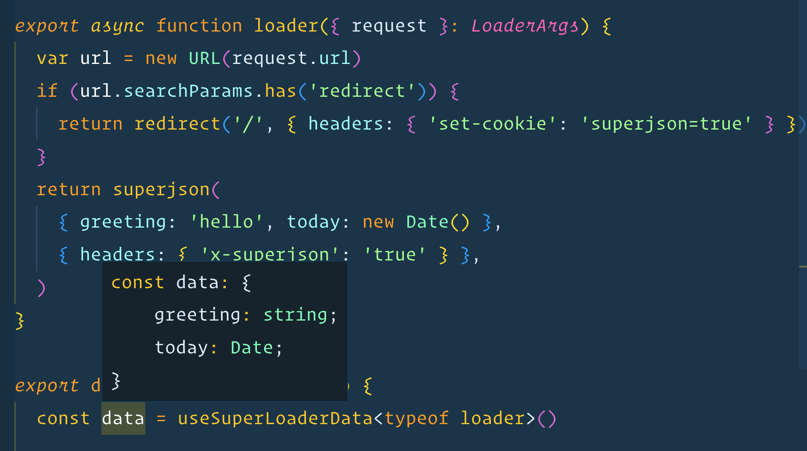

# Remix SuperJSON

This sample shows how to use the [`superjson`](https://www.npmjs.com/package/superjson) package to safely serialize non-JSON data from
your loaders and get the correct types in your route component.

Thanks to the type inference support added to Remix v1.6.5, you also
get full fidelty type inference.

Demo: https://remix-superjson-production.up.railway.app

```ts
export async function loader({ request }: LoaderArgs) {
  var url = new URL(request.url)
  if (url.searchParams.has('redirect')) {
    return redirect('/', { headers: { 'set-cookie': 'superjson=true' } })
  }
  return superjson(
    { greeting: 'hello', today: new Date() },
    { headers: { 'x-superjson': 'true' } },
  )
}
export default function Index() {
  const data = useSuperLoaderData<typeof loader>()
  return <p>Today is {data.today.toLocaleString()}</p>
}
```


